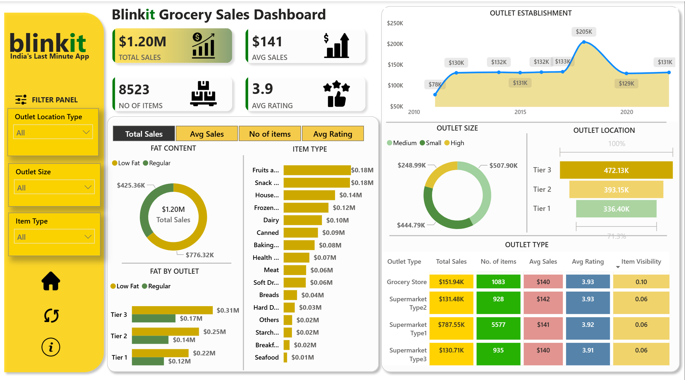

<!DOCTYPE html>
<html lang="en">
<head>
  <meta charset="UTF-8">
  <meta name="viewport" content="width=device-width, initial-scale=1.0">
  <title>Blinkit Grocery Sales — Data Analysis Project</title>
  <link href="https://fonts.googleapis.com/css2?family=Space+Mono:wght@400;700&family=Syne:wght@400;600;700;800&display=swap" rel="stylesheet">
  
</head>
<body>

  <!-- HEADER -->
  

    
blinkit

    
🛒 Blinkit Grocery Sales — Data Analysis Project

    
End-to-end analysis: Data Cleaning → SQL Insights → Power BI Dashboard

    

      Python 3.10+
      Pandas
      SQL
      Power BI
      Status: Complete
    

  

  

  <!-- DASHBOARD -->
  

    
📊 Dashboard Preview

    

      

        
        
        
        &nbsp; Blinkit Grocery Sales Dashboard — Power BI
      

      
      
📊 Add Blinkit-Dashboard.png to /assets/

    

  

  <!-- ABOUT -->
  

    
📌 About the Project

    

      This project performs a complete data analysis lifecycle on <strong>Blinkit's grocery sales dataset</strong>.
      Raw data was cleaned and transformed using <strong>Pandas</strong>, meaningful business insights were extracted
      using <strong>SQL queries</strong>, and everything was visualized in a fully interactive
      <strong>Power BI Dashboard</strong> — covering outlet performance, item categories,
      fat content split, tier-wise sales, and outlet establishment trends.
    

  

  <!-- PIPELINE -->
  

    
⚙️ Project Workflow

    

      

        📦
        Raw Data
        CSV / Kaggle
      

      →
      

        🐼
        Pandas
        Clean & Format
      

      →
      

        🗄️
        SQL
        Insights
      

      →
      

        📊
        Power BI
        Dashboard
      

    

  

  <!-- STATS -->
  

    
📈 Key Numbers from Dashboard

    

      
$1.20MTotal Sales

      
$141Avg Sale

      
8,523Total Items

      
3.9 ⭐Avg Rating

    

  

  <!-- SQL INSIGHTS -->
  

    
🔍 Business Insights via SQL

    

      

🏪 Top outlet by revenue

Supermarket Type 1 — $787.55K

      

📍 Best performing tier

Tier 3 — $472.13K in sales

      

🛍️ Most sold item category

Fruits & Snacks — $0.18M each

      

📅 Peak outlet year

2018 — $205K revenue

      

🥗 Fat content revenue split

Low Fat $776K vs Regular $425K

      

👁️ Best item visibility

Grocery Store — 0.10 score

    

  

  <!-- TECH STACK -->
  

    
🛠️ Tech Stack

    

      

PythonCore language

      

PandasData wrangling

      

MySQLSQL queries

      

Power BIDashboard viz

      

JupyterEDA notebooks

    

  

  <!-- FILE TREE -->
  

    
📁 Project Structure

    

      📦 blinkit-analysis/ 
      ├── data/ 
      │&nbsp;&nbsp; ├── blinkit_raw.csv&nbsp;&nbsp;&nbsp;&nbsp;&nbsp;&nbsp;&nbsp;&nbsp;&nbsp;&nbsp;← original dataset 
      │&nbsp;&nbsp; └── blinkit_cleaned.csv&nbsp;&nbsp;&nbsp;&nbsp;&nbsp;← after Pandas cleaning 
      ├── notebooks/ 
      │&nbsp;&nbsp; ├── 01_data_cleaning.ipynb&nbsp;&nbsp;← null handling, formatting 
      │&nbsp;&nbsp; └── 02_eda_analysis.ipynb&nbsp;&nbsp;&nbsp;← exploratory analysis 
      ├── sql/ 
      │&nbsp;&nbsp; └── insights_queries.sql&nbsp;&nbsp;&nbsp;&nbsp;← all business queries 
      ├── assets/ 
      │&nbsp;&nbsp; └── blinkit_dashboard.pbix&nbsp;&nbsp;← Power BI file 
      ├── README.md 
      └── requirements.txt
    

  

  

  <!-- CONTACT -->
  

    
🙋 Connect with Me

    

      
📸 Instagram <a href="https://www.instagram.com/self_explore3">@itz_roshansingh</a>

      
💼 LinkedIn <a href="https://www.linkedin.com/in/itz-roshan/">Roshan</a>

      
🐙 GitHub <a href="https://github.com/itz-roshan">@itz-roshan</a>

    

    

      Dataset from <a href="https://www.kaggle.com/">Kaggle</a> &nbsp;•&nbsp;
      Made with ❤️ by <strong>@roshan</strong>
    

    
⭐ If this helped you, please star the repo!

  

</body>
</html>
